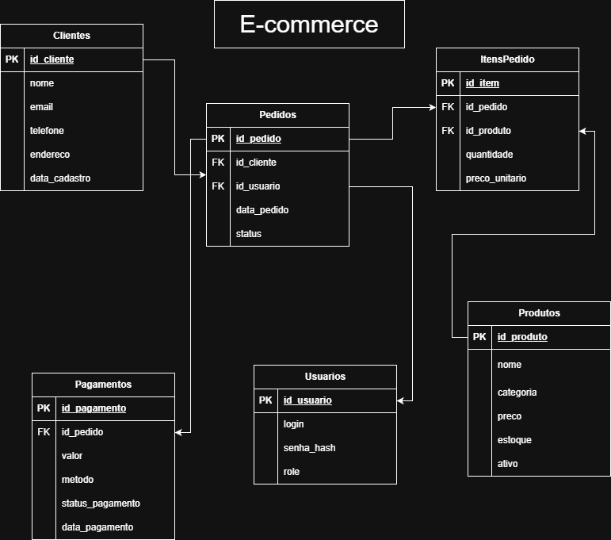

# E-commerce Relacional: Administração e Modelagem (PostgreSQL)

Este repositório contém a modelagem, os scripts de implementação e as rotinas de manutenção de um banco de dados relacional projetado para um sistema de e-commerce. O projeto foi desenvolvido para demonstrar práticas de Administração de Banco de Dados (DBA), englobando desde a criação estrutural até a geração de carga para testes de performance, automação de regras de negócio e estratégias de backup.

##  Tecnologias e Ferramentas
* **SGBD:** PostgreSQL 15
* **Infraestrutura:** Docker e Docker Compose
* **Linguagem:** SQL (DDL, DML, DQL, DCL e PL/pgSQL)

## Modelo Entidade-Relacionamento (DER)
O modelo relacional foi arquitetado na 3ª Forma Normal (3FN) para suportar o ciclo de vida completo de pedidos, clientes, controle de estoque e auditoria de pagamentos.



## ⚙️ Destaques Técnicos e Funcionalidades
* **Geração de Dados em Larga Escala:** Utilização nativa do `generate_series()` para injetar milhares de registros simultâneos (clientes, produtos, pedidos), simulando um ambiente de produção para testes de queries e planos de execução.
* **Regras de Negócio no Banco (Triggers e Procedures):** Implementação de gatilhos para bloqueio de vendas de produtos sem estoque e procedures para automação da baixa de inventário após a aprovação de pedidos.
* **Visões Analíticas (Views):** Estruturas preparadas para consumo de ferramentas de BI, consolidando o faturamento e o status de envio de forma otimizada.
* **Manutenção e Recuperação (Disaster Recovery):** Estruturação de jobs para backups lógicos diários utilizando `pg_dump` com políticas de retenção de dados via shell script.

## Estrutura de Diretórios
```text
postgres-ecommerce-dba-jr/
├── docs/                     # Diagramas e documentação do modelo
│   ├── DER.png
│   └── descricao_modelo.md
├── scripts/                  # Scripts SQL ordenados para deploy
│   ├── 01_criacao_tabelas.sql
│   ├── 02_inserts_dados.sql
│   ├── 03_views.sql
│   ├── 04_procedures.sql
│   ├── 05_triggers.sql
│   └── 06_backup_restore.sql
├── jobs/                     # Rotinas de sistema operacional para o banco
│   └── job_backup_diario.sh
├── docker-compose.yml        # Orquestração do contêiner e volumes
└── README.md
```
##  Como Executar o Projeto Localmente
A infraestrutura está inteiramente conteinerizada para garantir consistência e facilitar testes rápidos de laboratório.

Clone o repositório:

* git clone [https://github.com/SEU_USUARIO/postgres-ecommerce-dba-jr.git](https://github.com/SEU_USUARIO/postgres-ecommerce-dba-jr.git)
* cd postgres-ecommerce-dba-jr
  
Suba o ambiente via Docker:

* docker-compose up -d
* O banco estará disponível na porta 5432 com os volumes de dados persistidos. Os scripts do diretório /scripts são executados automaticamente na ordem numérica durante o primeiro start do contêiner, deixando a base pronta para consultas.

## Sobre o Autor
Profissional com formação em Administração de Banco de Dados e infraestrutura de redes. Possui a certificação Microsoft Azure Data Fundamentals (DP-900) e experiência prática na conteinerização de serviços, orquestração de servidores e ambientes virtualizados, unindo o desenvolvimento de banco de dados com a estabilidade das operações de TI.

🔗 [LinkedIn](https://www.linkedin.com/in/gabriel-josé-dos-santos-pessôa-0349a71b0/) 
